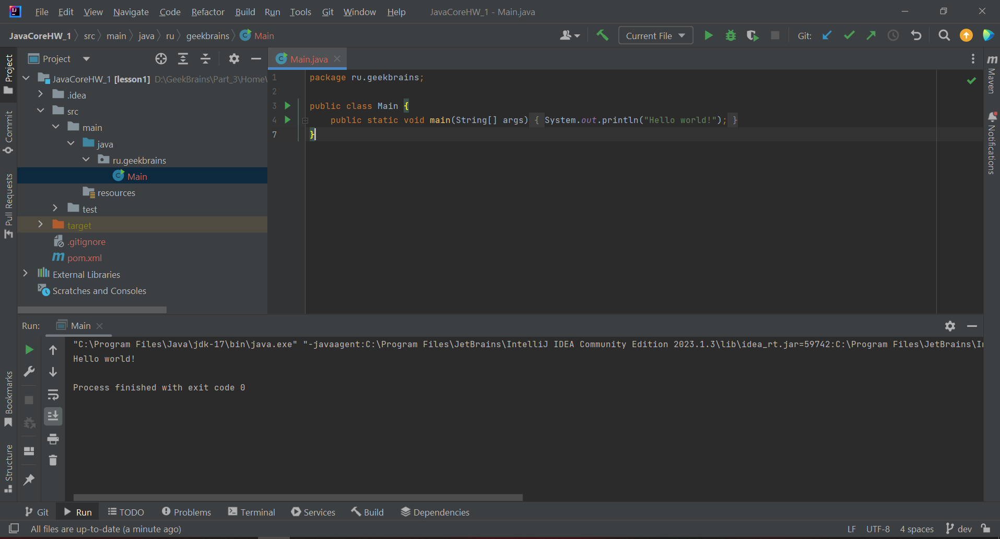
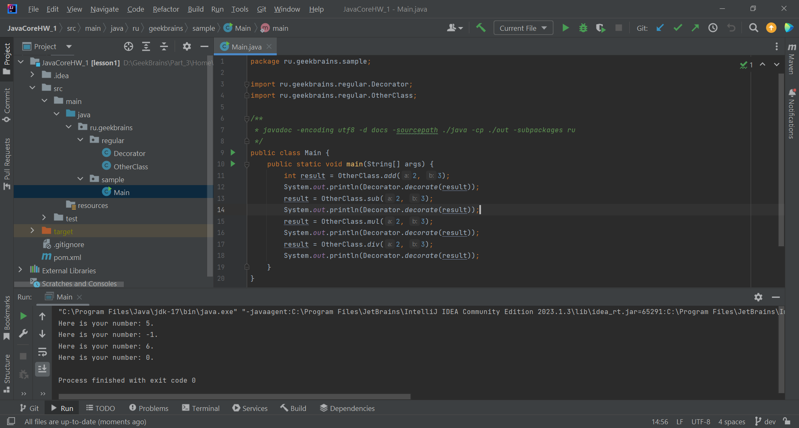
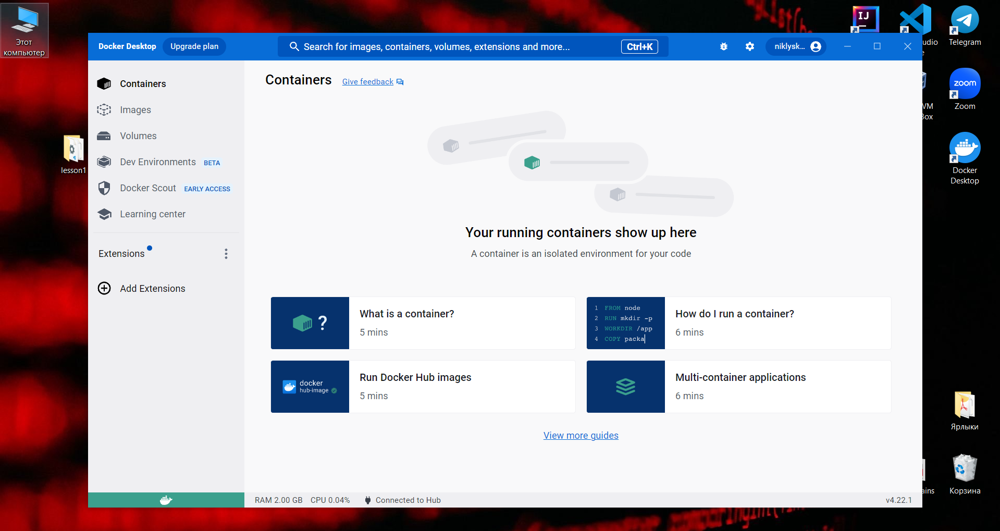
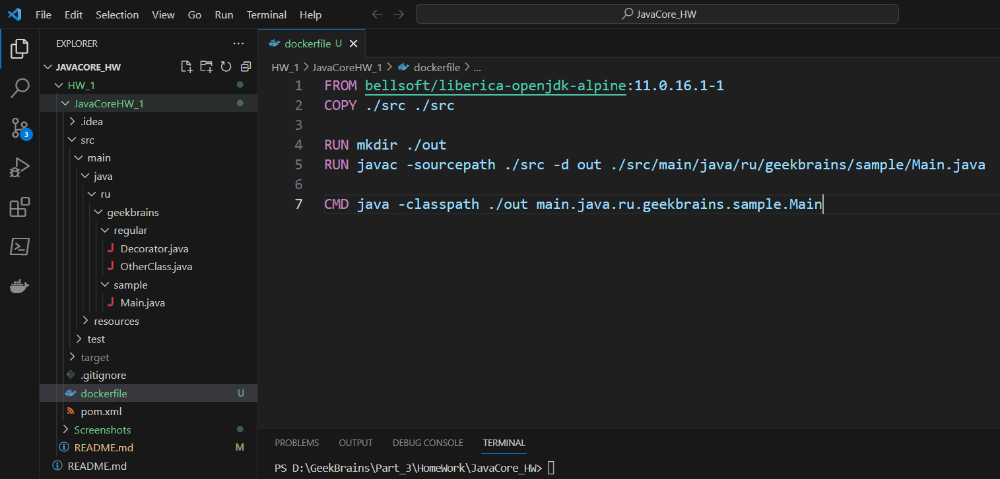
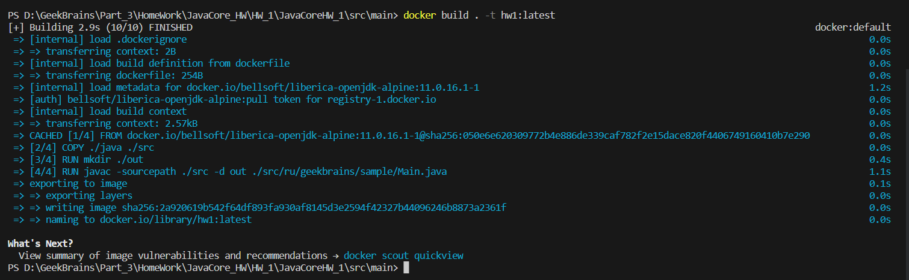
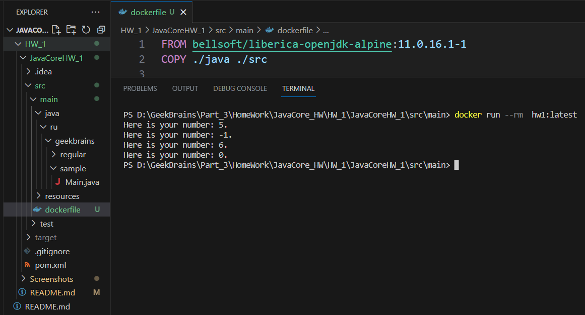
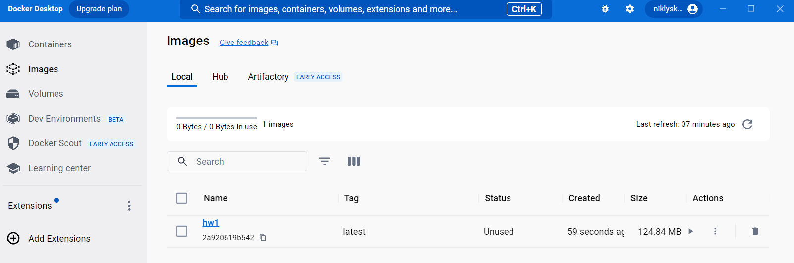

# Java Core (семинары)
## Урок 1. Компиляция и интерпретация кода
Разработать приложение с лекции все-таки придется.

Создать проект из трёх классов (основной с точкой входа и два класса в другом пакете),
которые вместе должны составлять одну программу, позволяющую
производить четыре основных математических действия и осуществлять форматированный
вывод результатов пользователю (ИЛИ ЛЮБОЕ ДРУГОЕ ПРИЛОЖЕНИЕ НА ВАШ ВЫБОР, которое просто демонстрирует работу некоторого механизма).

Необходимо установить Docker Desktop.

Создать Dockerfile, позволяющий откопировать исходный код вашего приложения в образ для демонстрации работы вашего приложения при создании соответствующего контейнера.

Подобную процедуру мы с вами проделали на уроке, теперь необходимо проделать данную процедуру самостоятельно.


### Ход решения:

1. Создали новый проект под названием "JavaCoreHW_1" и запустили его для проверки работоспособности.



2. Создаем дополнительные классы "Decorator" и "OtherClass". Заполняем их необходимым кодом. Обязательно распрелеляем по package. Собираем и запускаем приложение. Всё работает.



3. Необходимо установить Docker Desktop.
Переходим по ссылке  https://www.docker.com/products/docker-desktop/ и устанавливаем.



4. Создать Dockerfile, позволяющий откопировать исходный код вашего приложения в образ для демонстрации работы вашего приложения при создании соответствующего контейнера.

- создаём Dockerfile и заполняем его следующим содержимым:

```docker 
FROM bellsoft/liberica-openjdk-alpine:11.0.16.1-1
COPY ./java ./src

RUN mkdir ./out
RUN javac -sourcepath ./src -d out ./src/ru/geekbrains/sample/Main.java

CMD java -classpath ./out ru.geekbrains.sample.Main
```



- далее пишем в терминале 2 команды:

```bash
docker build . -t hw1:latest 
docker run -rm hw1:latest
```





